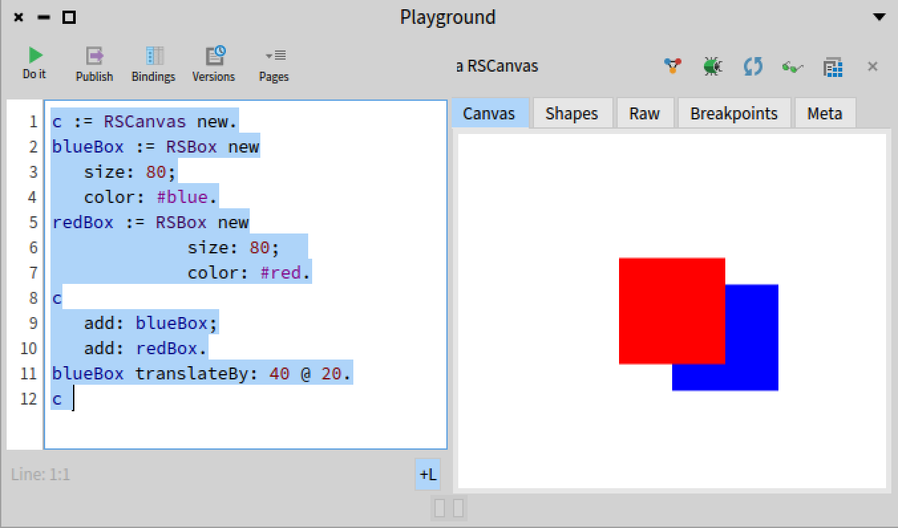
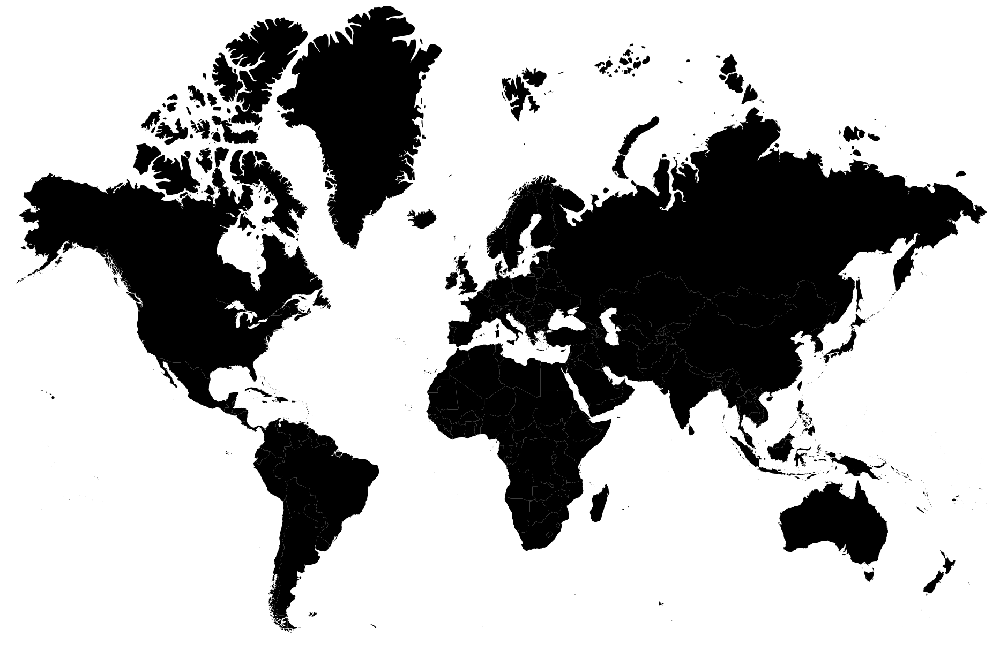
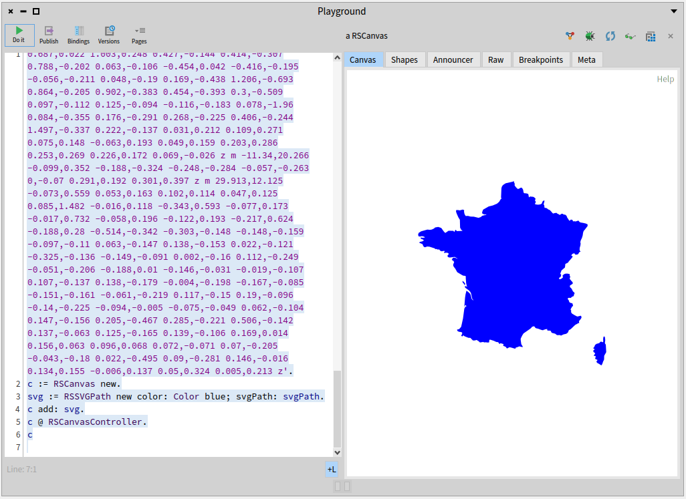
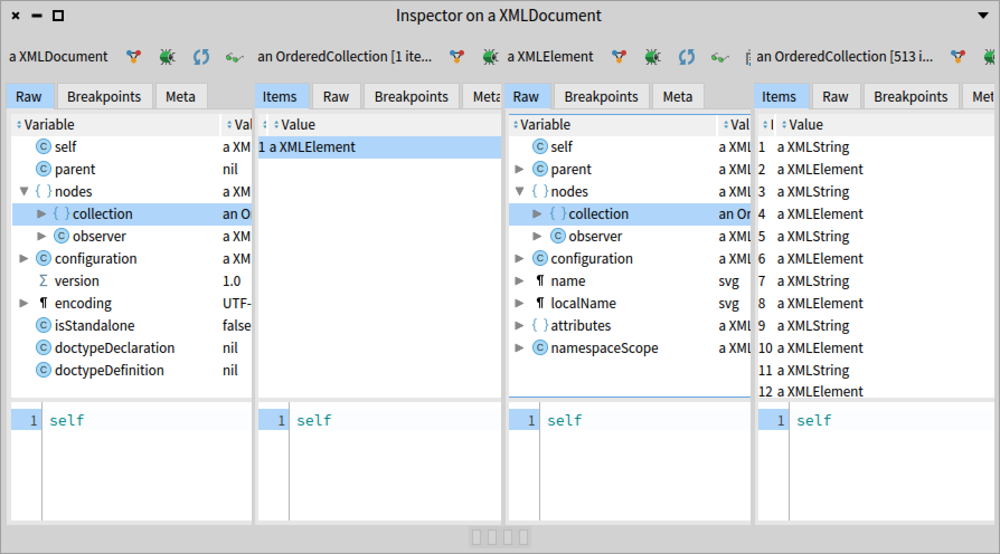
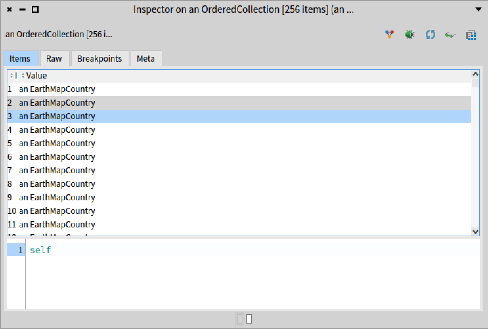
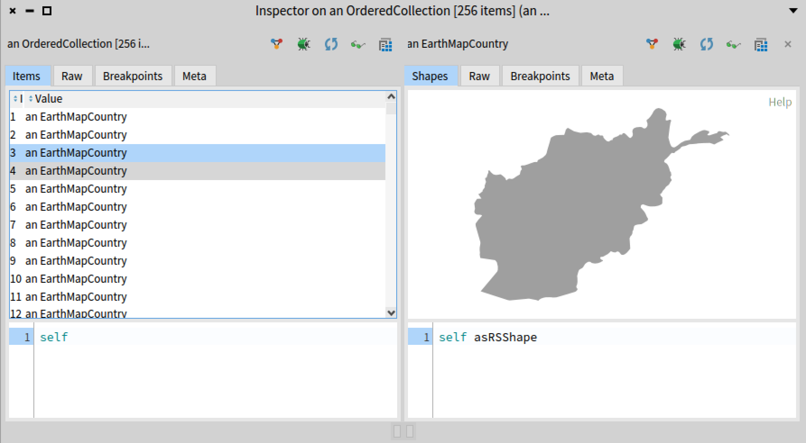
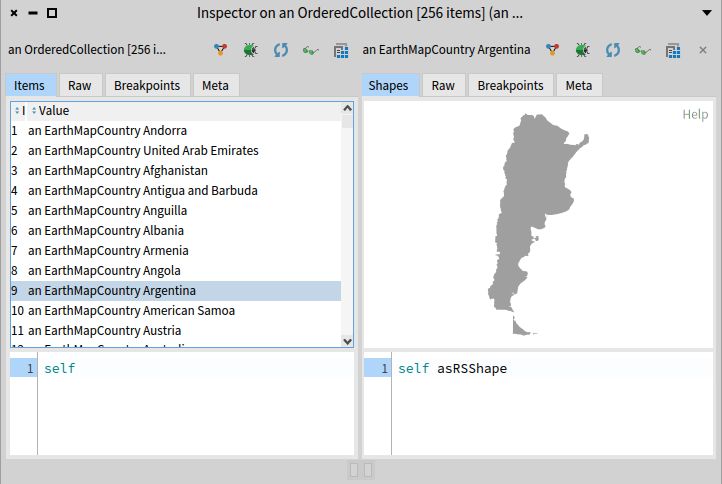
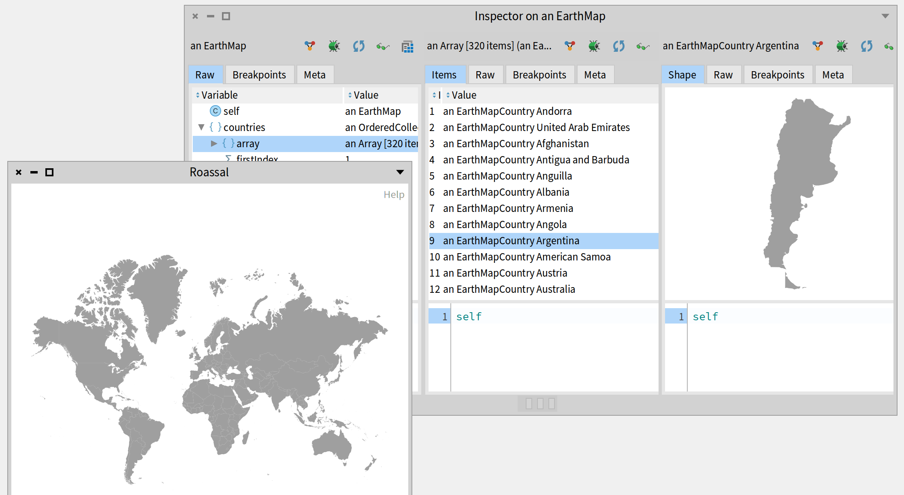
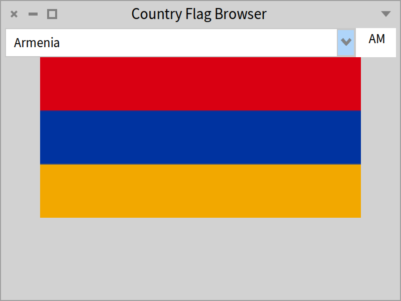
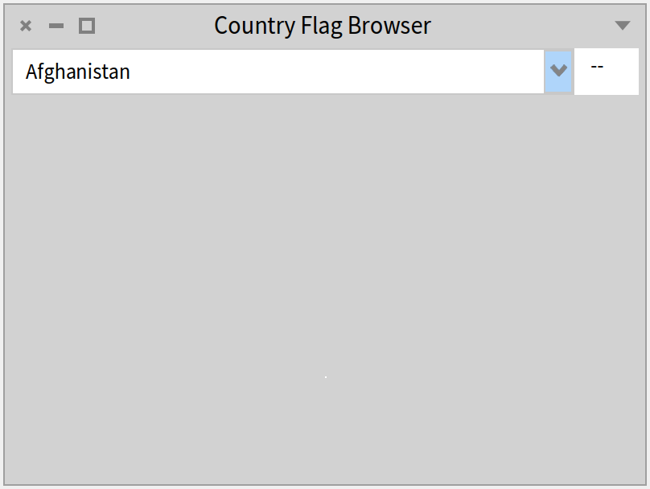

## Flag and country exercises


In this tutorial, we will take a concrete approach to teach you some Pharo code. 
- You will learn how to draw a country shape using Roassal (a visualization engine).
- In a second step, you will use an HTTP client to grab the flag of the country based on its unique international id. 
- You will then define a small visual application using the Spec UI builder and it will display the country, its ID, and flag.

### Resources

This tutorial uses the following resources: 
- The Roassal visualization engine. [Roassal @ https://github.com/pharo-graphics/Roassal ](https://github.com/pharo-graphics/Roassal).
- An XML parser [XML Parser @ https://github.com/pharo-contributions/XML-XMLParser ](https://github.com/pharo-contributions/XML-XMLParser).
- A file `world.svg`. This SVG file defines country shapes as shown in Figure *@svgrendered@*.
- The Spec UI builder that supports the definition of user interface. [Spec book @https://github.com/SquareBracketAssociates/BuildingApplicationWithSpec2/releases ](https://github.com/SquareBracketAssociates/BuildingApplicationWithSpec2/releases).


### Roassal first script

Let us get started. 
Inspect the following code snippet to get two boxes drawn in the canvas.
You should get an inspector as shown in Figure *@figtwoboxes@*.

```
| c |
c := RSCanvas new.
blueBox := RSBox new
	size: 80;
	color: #blue.
redBox := RSBox new
	size: 80;	
	color: #red.
c
	add: blueBox;
	add: redBox.
blueBox translateBy: 40 @ 20.
c 
```




### World map

Now we are ready to display countries. The idea is that we will copy the SVG path definition from the world.svh file into a little Roassal program that renders SVG paths. 

- Check file world.svg, open it with a text editor.
- Copy the path of a country that you want to display, pick a little country it will help you.



### SVG shapes

Now we will display the SVG path you selected. In the following snippet we put 

Inspect the following code snippet: it produces a little bezier surface.
```
| c svg |
c := RSCanvas new.
svg := (RSSVGPath new
	svgPath: 'M 100 350 q 150 -300 300 0';
	yourself).
c addShape: svg.
c @ RSCanvasController.
c
```

Zoom out pressing the key O on the window. 
You should obtain a not-really exciting graphical form. 

### Display a country

Using the path defined in the world.svg file taking, for example, the path of France you should get the Figure *@france@*.


```
svgPath := 'm 482.92875,298.0884 ...'.
c := RSCanvas new.
svg := RSSVGPath new 
	color: Color blue; 
	svgPath: svgPath.
c add: svg.
c @ RSCanvasController.
c
```




### Loading an XML Parser
So far it was fun but too manual.
We will use an XML parser. In addition we will represent each country as an object that we can manipulate later. 

Check if the XMLParser is loaded in your image. Else you can 
load the XML parser available at `https://github.com/pharo-contributions/XML-XMLParser`

```
Metacello new
  baseline: 'XMLParser';
  repository: 'github://pharo-contributions/XML-XMLParser/src';
  load.
```

### Tweaking XML tree

Using the following snippet, inspect the tree returned by the parser.

```
(XMLDOMParser parse: 'world.svg' asFileReference readStream contents) document inspect 
```

Dabble the data and find the list of countries. You can see this in Figure *@xml@*.
It shows that the field `'nodes'` contains a collection that contains one collection that finally 
contains a list of elements. 




Now we would like to convert all the elements into a little class representing countries
so that we can manipulate it later.

### The country class

#### Create a country class.

```
Object << #EarthMapCountry
	slots: { #svgPath . #name . #code };
	package: 'SummerSchool'
```

### Define methods

- Define the corresponding accessors.
- Define a method that creates an instance of `EarthMapCountry` from an element. 

```
EarthMapCountry >> fromXML: aXMLElement
	
	svgPath := aXMLElement attributeAt: 'd'.
	name := aXMLElement attributeAt: 'title'.
	code := aXMLElement attributeAt: 'id'.
```

- Define a method that returns the Roassal SVG shape of a country

```
EarthMapCountry >> asRSShape
	^ RSSVGPath new svgPath: svgPath
```


### Grabbing a first country

Now we can convert an element from the XML file and create the corresponding
`EarthMapCountry` instance. (For the XML expert we should not do it that way but use a SAXParser but this is not the point of this tutorial). 

```
country := EarthMapCountry new
	 fromXML: (XMLDOMParser parse: 'world.svg' asFileReference readStream contents) document nodes first nodes second.
country asRSShape inspect
```




#### All countries 

Now let us grab all the countries.
The following snippet is a cheap and hacky way to create all the countries from the SVG file.

```
| col |
col := OrderedCollection new. 
(XMLDOMParser parse: 'world.svg' asFileReference readStream contents) 
	document nodes first nodes 
		do: [ :node | (node class = XMLElement) 
				ifTrue: [ col add: ( EarthMapCountry new fromXML: node) ]].
col inspect
```

Then you can see a list of countries as shown in Figure *@dry@*.


### Empowering developers in action
Ok we see the list of objects in the inspector. 
but we can do better, we want to see __in__ the inspector the shape of the country.
For this, we define the following method that extends the inspector. 
You should get the situation shown by Figure *@noprint@*.

```
EarthMapCountry >> inspectorShape
	<inspectorPresentationOrder: 0 title: 'Shape'>
	
	| canvas |
	canvas := RSCanvas new.
	canvas add: self asRSShape.
	canvas @ RSCanvasController.
	^ SpRoassalInspectorPresenter new canvas: canvas; yourself
```




Since looking at a  list of similar elements does not give any useful information we can simply enhance the experience by adding a little `printOn:` method as follows:

```
EarthMapCountry >> printOn: aStream
	super printOn: aStream.
	aStream nextPutAll: ' ', name
```

We can now see and make sense of the list as shown in Figure *@print@*.



You can enhance the `printOn:` method to display the country code. 

### Introduce the World 

We used the following snippet of code but this is a bit brittle.  
```
| col |
col := OrderedCollection new. 
(XMLDOMParser parse: 'world.svg' asFileReference readStream contents) 
	document nodes first nodes 
		do: [ :node | (node class = XMLElement) 
				ifTrue: [ col add: (EarthMapCountry new fromXML: node) ]].
col
```
 
We could do better. We could define a class that holds countries. 
We will define a new class whose responsibilities will be to import the country list and act as a mini database
for the future functionalities we want to implement (such as a flag browser). 

#### Defining the map country

```
Object << #EarthMap
	slots: { #countries };
	package: 'EarthTutorial'
```

We initialize the `countries` instance variable to an `OrderedCollection`.

```
EarthMap >> initialize

	super initialize.
	countries := OrderedCollection new
```

We define the method `importCountryFromXMLNode:` that converts an XML node representing a country into a country object.

```
EarthMap >> importCountryFromXMLNode: aXMLElement

	countries add: (EarthMapCountry new fromXML: aXMLElement)
```

We define the method `xmlTreeFromFile:` that given a file name returns the corresponding 
XML tree

```
EarthMap >> xmlTreeFromFile: aFileName

	^ aFileName asFileReference readStreamDo: [ :stream |
		(XMLDOMParser parse: stream) document ]
```

```
EarthMap >> populatedCanvas

	^ RSCanvas new
		  addAll: (countries collect: [ :country | country asRSShape ]);
		  @ RSCanvasController;
		  yourself
```

```
EarthMap >> openPopulatedCanvas

	self populatedCanvas open
```

Now we are ready to get a map and display it. 
The following snippet returns a map with filed-up countries and opens a Roassal canvas displaying all the countries. 

```
EarthMap new
	importCountriesFrom: (FileSystem workingDirectory / 'pharo-local' / 'iceberg' / 'EarthTutorial' / 'resources' /'world.svg' );
	openPopulatedCanvas;
	yourself
```




### A little note about our process

We defined the previous methods one by one. Notice that we could have started from the original code snippet, turn it into a method and apply multiple extract methods and other refactorings. 


### Grabbing flags from flagcdn
We are ready to work on a country browser displaying its name, flag, and shape. 
The first thing is to get a flag. For this we will use the [https://flagcdn.com/](https://flagcdn.com/)


The following script gives you the principle to get a flag in png from the web.
Adapt it to get the flag of the country of your choice. Notice that the `<code>` is expected in lowercase (i.e. fr and not FR). 

```
| request pngArray |
request := ZnClient new.
request get: 'https://flagcdn.com/w320/<code>.png'.
request isSuccess ifTrue: [
	pngArray := request response contents ].
pngArray
```

The following expression creates a bitmap image from a byte-array representing a png `ImageReadWriter formFromStream: (ReadStream on: pngArray))`.
Use it with the previous snippet to be able to display a flag in PNG format.


### Spec user interface

We will now define a simple user interface to display the list of countries and when we click on one it shows the tag and the flag (See Figure *@flagB@*).



#### New presenter. 

First we define a new class `EarthCountryBrowser`. It inherits from the class `SpPresenterWithModel`. 

```
SpPresenterWithModel << #EarthCountryBrowser
	slots: { #countryList . #countryCode . #countryFlag  };
	package: 'EarthTutorial'
```

The instance variables are:
- `countryList` is a presenter of the list of country names. It is a drop list presenter.
- `countryCode` is a presenter to display the country code such as FR or CH. It is a input field presenter.
- `countryFlag` is a presenter for the flag. It is an image presenter. 
- map is an instance of the class `EarthMap`.

#### Initialize sub components.

With the method `initializePresenters`, we initialize the different presenters that compose our interface. 

```
EarthCountryBrowser >> initializePresenters

	super initializePresenters.

	countryList := self newDropList.
	countryList display: [ :item | item name ].
	countryList sortingBlock: [ :a :b | a model name < b model name ].
	countryList items: self model countries.

	countryCode := self newTextInput.
	countryCode editable: false.
	countryCode text: '   --   '.

	countryFlag := self newImage
```

#### Layout the elements.

We set the placement of the subcomponents by defining the method `defaultLayout`.

```
EarthCountryBrowser >> defaultLayout

	^ SpBoxLayout newTopToBottom
		  add: (SpBoxLayout newLeftToRight
				   add: countryList expand: true;
				   add: countryCode width: 40)
		  height: self class toolbarHeight;
		  add: countryFlag height: 350;
		  yourself
```

At this stage you should be able to open the browser even if it is not fully working. 

Here is the snippet we used during this tutorial. 

```
(EarthCountryBrowser on:
	(EarthMap new importCountriesFrom: (FileSystem workingDirectory / 'pharo-local' / 'iceberg' / 'EarthTutorial' / 'resources' /'world.svg' )))
	open 
	
```




### Enhancing the browser

We turn the snippet that we used to fetch flags into a method named `flagForCountryCode:`.
Notice that if the request fails we return a blue red rectangle. 

```
EarthCountryBrowser >> flagForCountryCode: astring

	| request pngArray |
	request := ZnClient new.
	request get:
		'https://flagcdn.com/w320/' , astring asLowercase , '.png'.
	request isSuccess ifTrue: [
		pngArray := request response contents.
		^ ImageReadWriter formFromStream: (ReadStream on: pngArray) ].
	^ BorderedMorph new asForm
```

Once this done we can know define the method `onCountrySelected:`
that will display the country code and the flag. We concatenate some spaces in front of the country code so that it looks better on the screen. 


```
EarthCountryBrowser >> onCountrySelected: countryItem

	countryCode text: '    ' , countryItem code.
	self showFlag: countryItem code
```

The method `onCountrySelected:` will be invoked each time the user selects a new country. 
The method `connectPresenters` is responsible for defining the interaction between the elements. Here we simply invoke the method `onCountrySelected:` each time a new country is selected. 

```
EarthCountryBrowser >> connectPresenters

	countryList whenSelectedItemChangedDo: [ :item |
    		self onCountrySelected: item ].
```

We let as an exercise the display of the roassal visualization. 
For this you can add a new component to the browser and initialize it to `newRoassal`. 
The message `newRoassal` creates an instance of the class `SpRoassalPresenter`. 
You specify set and get the canvas (using the messages `canvas` and `canvas:`) to be displayed. 


### Conclusion
In this little tutorial, we show several important aspects of Pharo. 

- First, in a couple of lines we created a little tool. We took the time to decompose scripts into objects and gave such objects responsibilities (such as import, conversion, ...)
- Second, we show how we can dabble complex objects and navigate easily in their structure.
- Third, we show that we can easily extend the tools of the environment to get more information about our own data. 

All this makes Pharo a really productive platform to model business while improving the feedback loops and speed to manipulate data.


